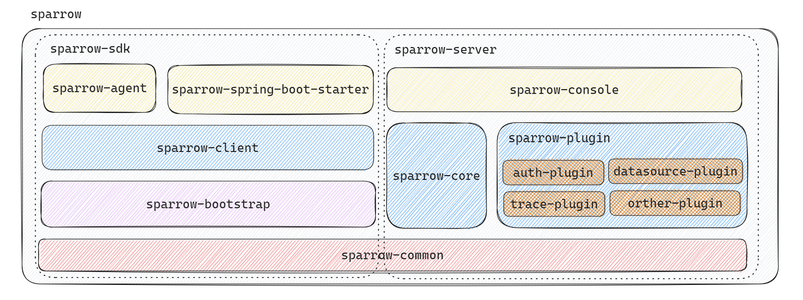

# sparrow

> 包含`log-gather`, `thread pool agent`等强大功能。  
> v1.x版本将会使用http作为主要传输协议进行快速上线  
> v2.x+会考虑使用grpc作为主要传输协议并且兼容v1.x

## sparrow依赖关系

`sparrow-common` 公共包

`sparrow-bootstrap` bootstrap包
`sparrow-client` 客户端-->bootstrap  
`sparrow-agent` agent包-->client  
`sparrow-spring-boot-starter` dubbo,nacos自动装配-->client

`sparrow-plugin` 插件化设计-->common  
`sparrow-core` 核心包-->plugin  
`sparrow-console` 控制台-->core

## sparrow架构图



## 快速使用

### 1. 通过git拉取最新源码到本地

```shell
git clone git@github.com:985492783/sparrow.git
```

### 2. 编译打包项目

```shell
maven clean install -DskipTests
```

### 3. 通过agent注入到本地项目中

VM options
> `${SPARROW_AGENT_HOME}`和`${SPARROW_BOOTSTRAP_HOME}`为真实的包位置

```text
-javaagent:${SPARROW_AGENT_HOME}\sparrow-agent.jar
-Xbootclasspath/a:${SPARROW_BOOTSTRAP_HOME}\sparrow-bootstrap.jar
```

agent options

|       选项        | 是否必要  |        含义         |   默认值   |
|:---------------:|:-----:|:-----------------:|:-------:|
|   logEnabled    |   否   |    开启logAgent     |  false  |
| executorEnabled |   否   | 开启threadPoolAgent |  false  |
|      name       |   否   |  注册到console中的名称   | 随机16位英文 |

### 4. （非必要）将数据上发到控制台

1. 引入client maven

```java
<dependency>
<groupId>com.sparrow</groupId>
<artifactId>sparrow-client</artifactId>
<version>${lastest.version}</version>
</dependency>
```

```java
SparrowClient instance=new SparrowClient(SparrowConfig.getInstance());
        instance.register("127.0.0.1:8888");
```

2. 直接引入starter

```java
<dependency>
<groupId>com.sparrow</groupId>
<artifactId>sparrow-spring-boot-starter</artifactId>
<version>${lastest.version}</version>
</dependency>
```
配置
```yaml
sparrow:
  trace:
    protocols: com.sparrow.trace.http.HttpTraceFilter
  client:
    name: test-to-client
    host: 127.0.0.1:8888
```
